ADS programming exercises
==========================

Intended audience: Students of *Algorithms and Data Structures* (ADS), Aarhus University.

In ADS, you have to solve a number of programming tasks along the way.
The programming tasks should be solved in Java using the [IntelliJ](https://www.jetbrains.com/idea/) programming environment.

To solve a programming task, first find the task either in
Brightspace or in the [tasks list](tasks/README.md) of this repository.
Read the task description, and start solving the task!

To upload your solution, you need three things:

  * Task ID (from the task description)
  * Username (`adsYY-djXXXX`, where `YY` is the current year and `XXXX` is your programming group number, found on Brightspace grade)
  * Password (from Brightspace grade)

If you have technical problems, contact Daniel Anker Hermansen on the Brightspace discussion board.
See also the list of [common mistakes](#common-mistakes).

Step-by-step guide for IntelliJ
------------------
1. Install IntelliJ and Java by following this [guide](https://magnus-madsen.github.io/course-intprog/technical-help.html). If you already have IntelliJ installed skip this step.
1. Create a new project in IntelliJ. Untick the `Add sample code` option.
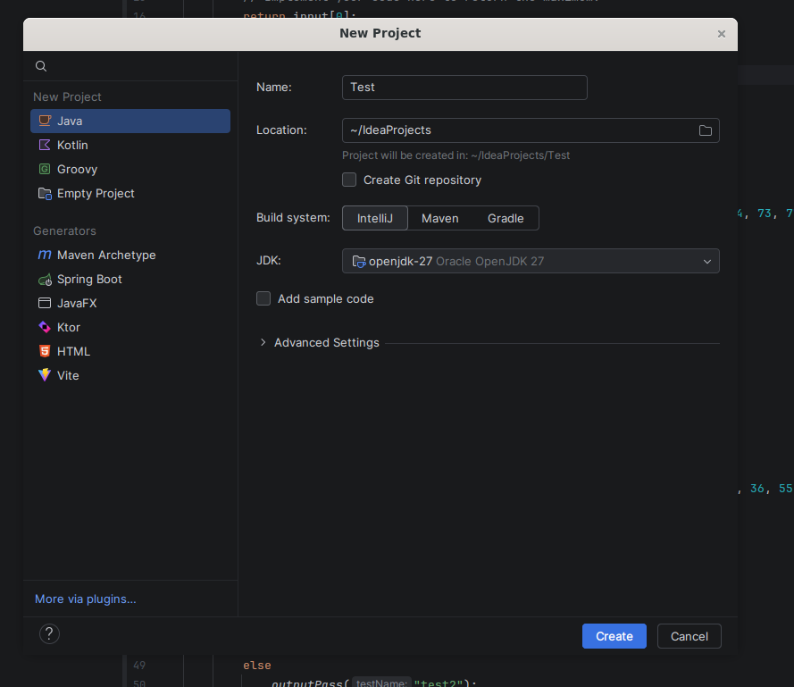
1. Find the task you want to solve. For this demo we solve the `maxdelsum` problem. Note the task id which for this task is `maxdelsum-2`. We will need this later.
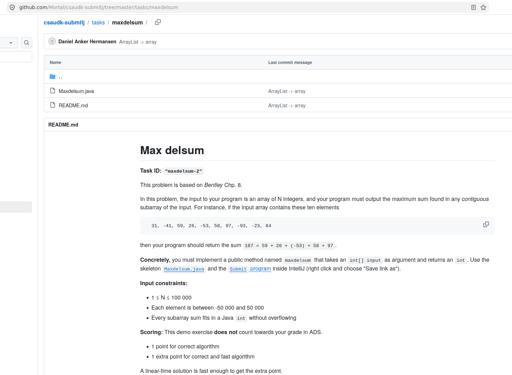
1. Save the task file(s) in the `src` folder in your project. 
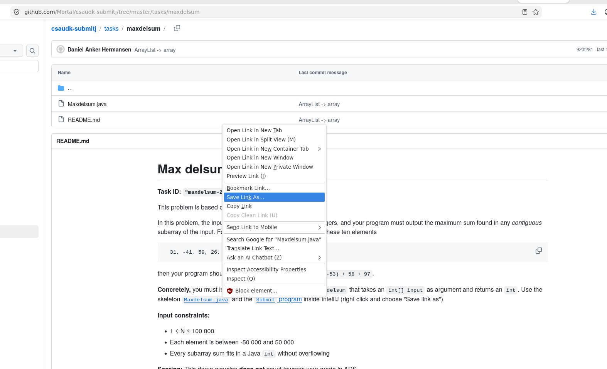
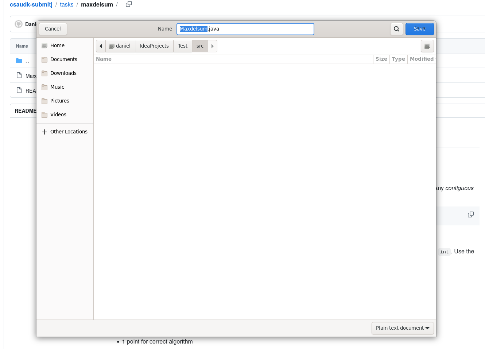
1. Save the `Submit` program in the `src` folder in your project. The `Submit` program is the same for all tasks.
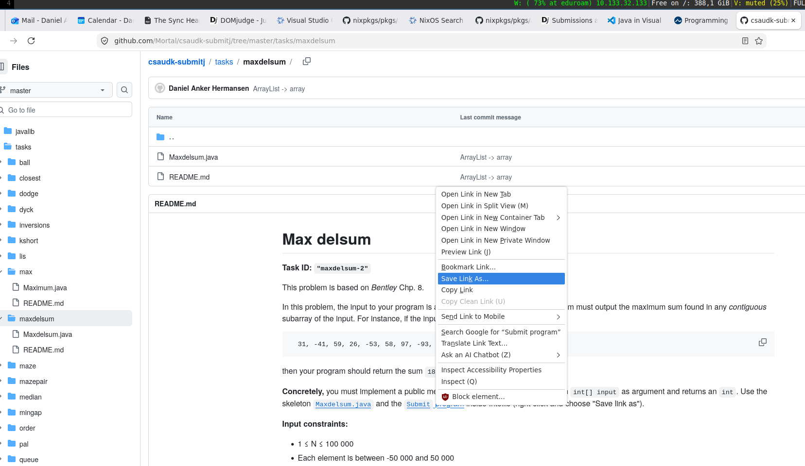
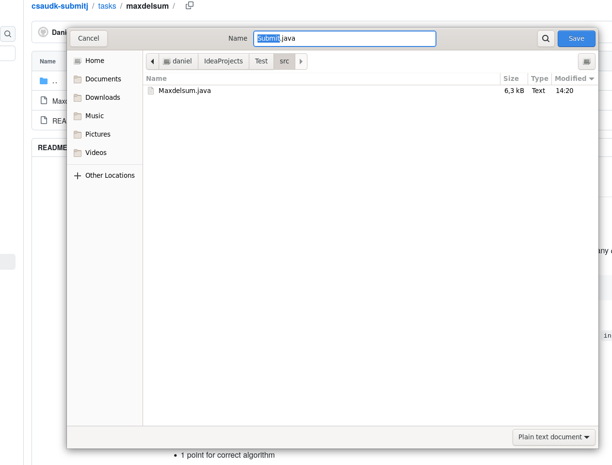
1. Open the task file(s) and implement your solution. Edit only in the function(s) which you are supposed to implement. In particular DO NOT edit the main method of the task file(s).
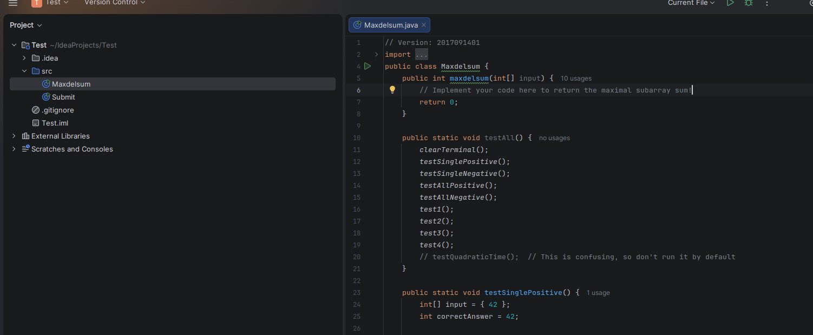
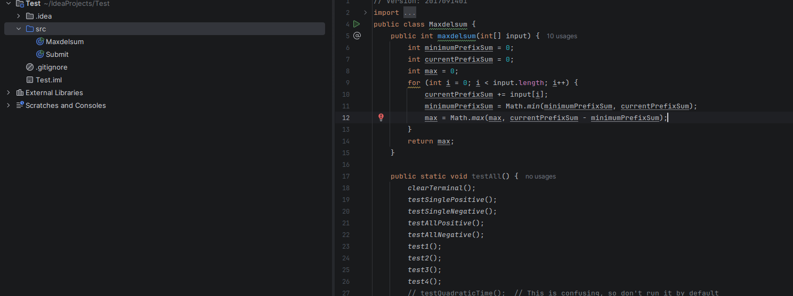
1. To test the implementation, open the Submit.java file. In the main method at the top, add calls to the static test methods in the provided files for the task, and run the code (Using the green triangle. Do not run it from the terminal). For this example the test method is `Maxdelsum.testAll`. In the `max` task this would be `Maximum.testAll`.
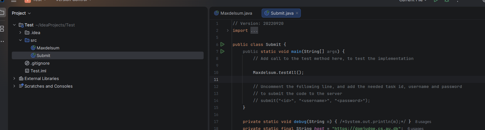
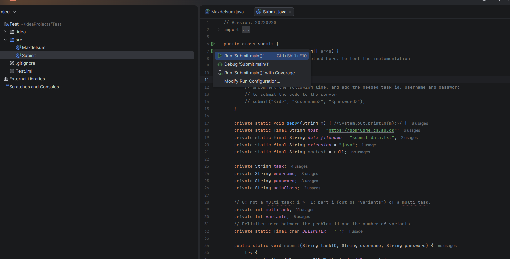
We see that the tests pass.
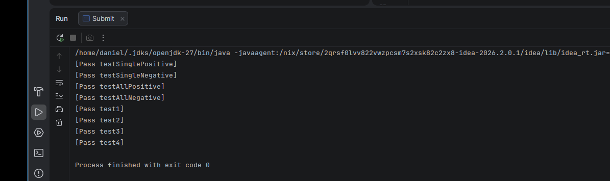
1. To submit the code, uncomment the line with the submit call in the main method, add the needed credentials, and run the code (Using the green triangle. Do not run it from the terminal).
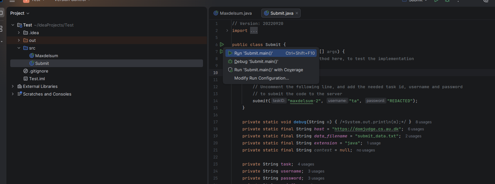
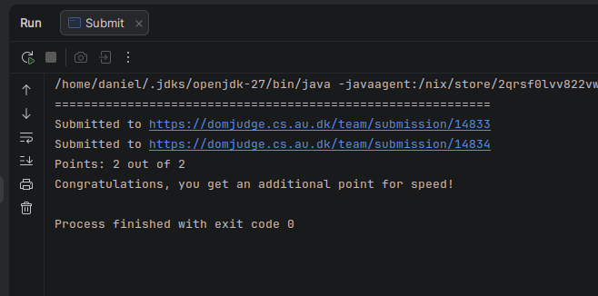

Guide for VSCode
------------------
Follow the guide for IntelliJ. Instead of creating a new project create a folder and open that folder in VSCode. Create a folder called `src` in the project. Place all files there. Run the `Submit.java` file through VSCode e.g. by pressing `f5`.

Manual Submisson
------------------
In case there are problems with submitting via `Submit.java`, manual submission can be done in your browser: [Submit](https://domjudge.cs.au.dk/team/problems). Note that for problems where you can get two points the problem exists twice e.g. ball1 and ball2. You have to submit to both to get both points.

Common mistakes
---------------

* **Submitting code that calls System.out for debugging.**
  System.out.println() is a good tool to use if you can't find out why your solution doesn't work.
  However, the judge gets confused if you leave in calls to System.out.println()
  when submitting your code, since it looks at the output of the main() method
  to determine if your solution is correct.
  Remember to comment out any System.out-lines in your own code before calling submit()!

If you believe there are other common mistakes that should be mentioned in this list,
let us know on the Brightpsace discussion board.
