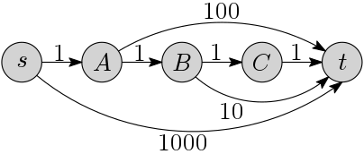
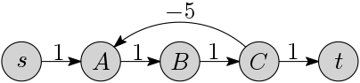
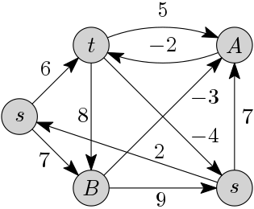

Short shortest paths
====================

**Task ID: `"kshort"`**

In the year 2050, all islands in Denmark are connected by toll bridges.
When crossing a bridge, the driver must pay a fee to a toll booth.
The price to cross a bridge is not necessarily the same in both directions.
Your friend Mogens wants to find the cheapest way to get from island A to island B.
However, he doesn't like interacting with toll booths,
so he wants to find the cheapest path that crosses at most *k* bridges.
Furthermore, Mogens is a member of a frequent traveller program
which gives great coupons and bonuses when crossing some bridges,
so in some cases the price to cross a bridge can be negative!

In this exercise you should implement an algorithm
to find the shortest path using at most *k* edges in a weighted graph G
from a given node *s* to a given node *t*.

The graph is represented by the number of nodes *n*,
each node being an integer between 0 and *n*−1,
along with a list of edges, each edge being a tuple (*u*, *v*, *w*)
indicating that the edge from *u* to *v* has weight *w*.

**Example 1:** In the following example, when *k* = 3 the shortest path from *s* to *t*
is sABt and has weight 12.

**Example 2:** In the following example, when *k* = 4 the shortest path sABCt has weight 4.
When *k* = 8 the shortest path sABCABCt uses 7 edges and has weight 1.
When *k* = 19 the shortest path sABCABCABCABCABCABCt has weight −11.

**Example 3:** (CLRS Fig. 24.4)
In the following example, when *k* = 1 or 2, the shortest path st has weight 6;
when *k* ≥ 3 the shortest path sBAt has weight 2.

**Concretely,** you must implement a method named
`shortestPath` that accepts the following parameters:

* `Edge[] edges` - each `Edge` consisting of the fields `from`, `to` and `weight`
* `int nodeCount` - the number of nodes *n* (nodes having indices 0 to *n*-1)
* `int maxEdges` - the value *k* indicating the maximum number of edges in a shortest path
* `int sourceNode` - the index of the source node *s* (between 0 and *n*-1)
* `int targetNode` - the index of the target node *t* (between 0 and *n*-1)

The method should return an `int` indicating the weight of the shortest path from *s* to *t*
consisting of at most *k* edges, or `Integer.MAX_VALUE` if there is no such path.

Use the skeleton files
<a href="https://github.com/Mortal/csaudk-submitj/raw/master/tasks/kshort/ShortPath.java">
`ShortPath.java`</a>
and
<a href="https://github.com/Mortal/csaudk-submitj/raw/master/tasks/kshort/Edge.java">
`Edge.java`</a>
and the
<a href="https://github.com/Mortal/csaudk-submitj/raw/master/Submit.java">
`Submit` program</a>
inside BlueJ (right click and choose "Save link as").

**Input constraints:**

  * Number of nodes: 2 ≤ n ≤ 10000
  * Number of edges: 1 ≤ m ≤ 10000
  * Max path length: 1 ≤ k ≤ 10000
  * Each edge weight is between −1000 and 1000

**Scoring:**

  * 1 point for correct and fast implementation

An O(k·m) algorithm is fast enough.

**Hint:** Modify Bellman-Ford.
